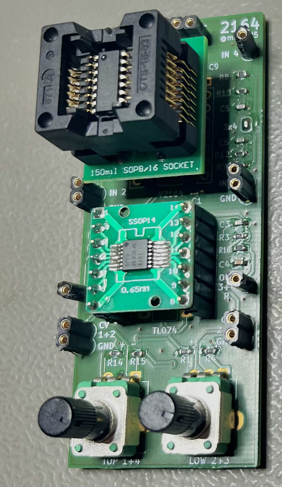

# V2164 Tester / Mixer

Simple board to test V2164 chips. Follows the application example in the SSM2164 datasheet.

Can also be used as a 2 channel stereo mixer.

| | |
|---|---|
|  |  |

## Status

Not tested yet. But looks nice.

### v0.1 Test results

* It works ✅
* Pot direction reversed - CCW turns gain up 😒
* right side ouput label should be "3+4" 🤷‍♂️
* Resistor divider - one would be enouth

### v0.2 not tested / will not test / should be ok.

* twisted Pot directions
* changed right out label
* added version label

## Gimmics

For cleverness sake, chip adapters can be used.

With R1/R4 and R14/R15 the range of the pots can be limited.  **For testing u can just short these**.
In theory 0V is 0dB and then the gain factor is -33mV/dB with a max range of -120..+20 dB, that equals 3.96V=-120dB to -0.66V=+20dB.

Ask your favorite chat bot for a voltage divider fitting your needs.

    To design a voltage divider with three resistors in series between +12V and -12V that meets your specified voltage requirements, we'll follow these steps:

    ### Given:
    - **Supply voltages**: +12V (top) and -12V (bottom)
    - **Middle resistor (R₂)**: 10 kΩ
    - **Desired voltage at top of R₂ (V₂)**: +3.96V
    - **Desired voltage at bottom of R₂ (V₃)**: -0.66V

    bla bla bla...

    ### Final Resistor Values:
    - **Top resistor (R₁)**: **17.4 kΩ**
    - **Middle resistor (R₂)**: **10 kΩ** (given)
    - **Bottom resistor (R₃)**: **24.55 kΩ**

    ### Practical Considerations:
    - You may need to use standard resistor values close to the calculated ones (e.g., 17.4 kΩ ≈ 17.8 kΩ or 18 kΩ; 24.55 kΩ ≈ 24.9 kΩ or 25 kΩ). 
    - For higher precision, you can use a potentiometer or combine resistors in series/parallel.

Or use the experimental [falstad circuit](https://www.falstad.com/circuit/circuitjs.html?ctz=CQAgjCAMB0l3BWcMBMcUHYMGZIA4UA2ATmIxAUgpABZsKBTAWjDACgA3WvcYlbkHirDaVMPxEwEnAdjQCwfKMppiJyqWwBOIFAkKCqeg2Bo1lYIXG279u1bYNyRe+GwDujkM-Bnv8yA8vIV9zEMDPGh5FflNzGKg2AAdQw1SE+hEweBzk9KU4-ypMixy3T0KfKKLEir8Q6vC8ulilFu9IcxKxMuswDHNjVNxBhwhs+ChYSCQAJQYAZwBLBYAXAEMAOwBjBjYAcxAWEyVj+0kD2jkO83bsBHUIo7AT-mqEp5HeN+uPvPv+CgHADvA9vBpkL1msQTH4aDCvN1IWUgvDYYM7IVPmCgUY7LjaqD+CC7p1CaTbgihoEgA).

### BOM

| References | Value | Footprint | Quantity |
|---|---|---|---|
| C5, C6, C7, C8               | 560p | 603 | 4 |
| C2, C3                       | 220p (100p+) | 603 | 2 |
| R2, R3, R5, R6, R7, R8 | 33k | 603 | 6 |
| R10, R11, R12, R13, R16, R17 | 470 | 0603 | 6 |
| R1, R4, R14, R15             | 5k see notes | 603 | 4 |
| *R9*                         | 7.5k for class A or *open for class AB* | 603 | 1 |
| U1                           | SSI2164 | DIP-16 7.62mm or SO-16 + Adapter | 1 |
| U2                           | TL074   or any such 4x OpAmp | DIP-14 7.62mm or SO/SOP/TSOP-14 + Adapter | 1 |
| RV1, RV2                     | 10k see notes | 9mm Potentiometer Vertical | 2 |

### Schematic

### Reference from DS

Also read the datasheet, just search for "V2164 pdf" or "SSM2164 pdf".